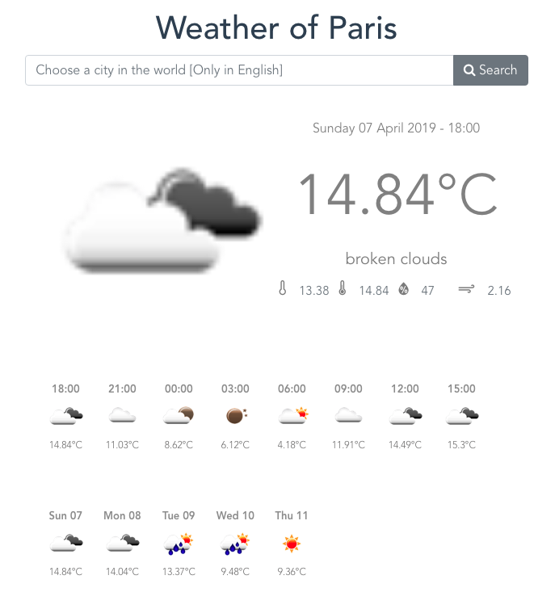

# Mes-tes-haut (la météo)

### Objectif du projet :
Manipulation des API météo: 
* Extration et affichage des données API météo (site [openweathermap](https://openweathermap.org/api))
  #### Technologie utilisées
* Langage **Javascript**
* Framework **vuejs**
* Framework **bootstrap** (cdn)

### Lien vers l'application 
[Mes-tes-haut](https://ho-be-one.github.io/mes-tes-haut/dist/index.html).

